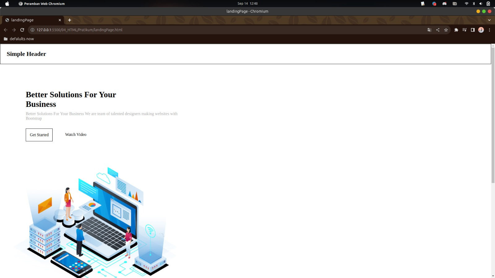
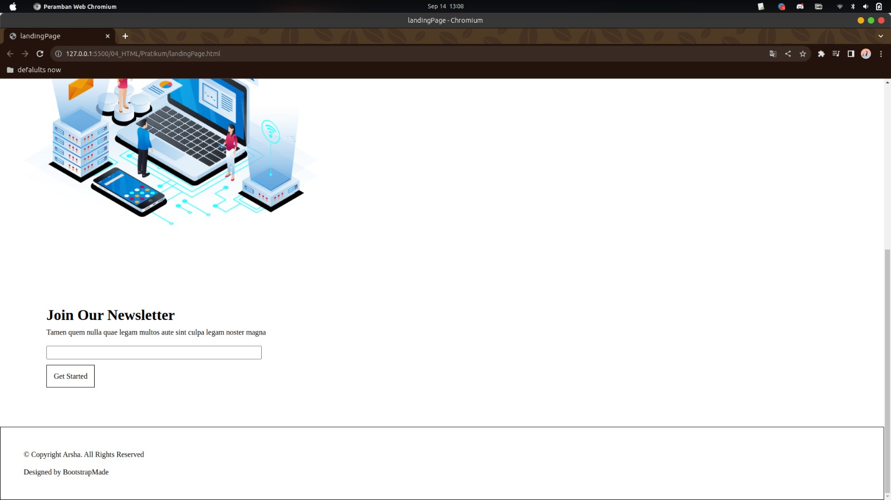

Soal Prioritas 1 (Nilai 80)
Buatlah sebuah halaman Create Product dengan nama file createProduct.HTML
Memiliki urutan dan nama form seperti di foto. atau bisa mengacu pada figma beriku. Link Figma

Soal Prioritas 2 (Nilai 20)
Buatlah halaman landing Page dengan nama file landingPage.html dengan struktur seperti berikut. link figma

Soal Eksplorasi (Nilai 20)
Lakukan validasi “required” pada setiap form yang telah dibuat
Terapkan standart validasi berikut
form product Product Name mempunyai minimal 6 huruf dan maksimal 50 huruf
Product Price harus berupa angka
Sambungkan halaman landingPage.html dengan CreateAccount.html sehingga dapat berpindah halaman

