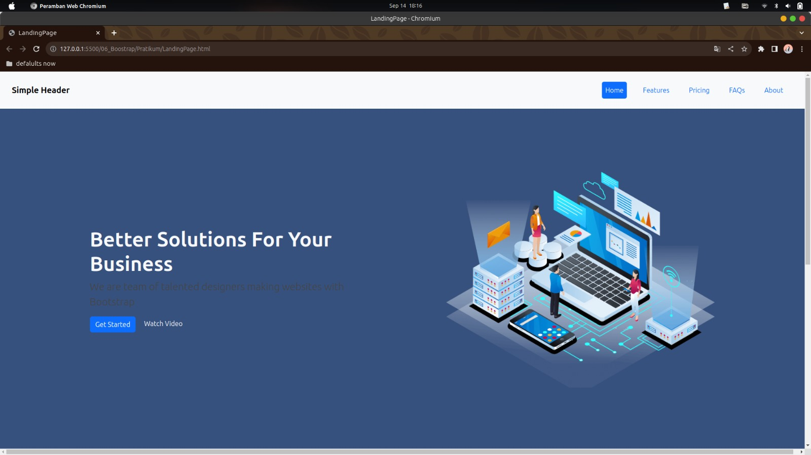
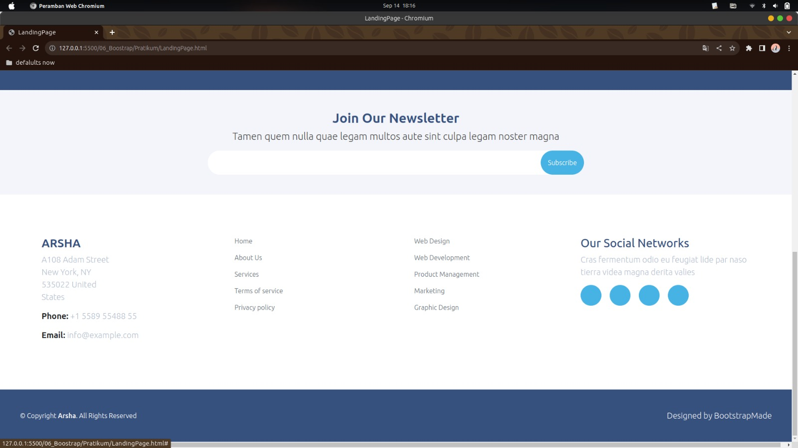
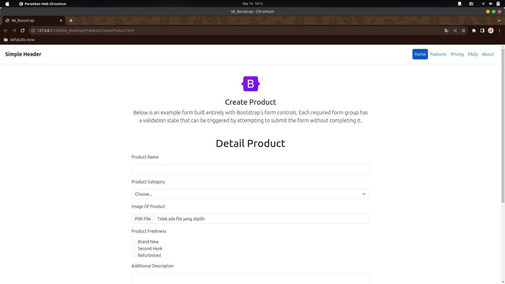
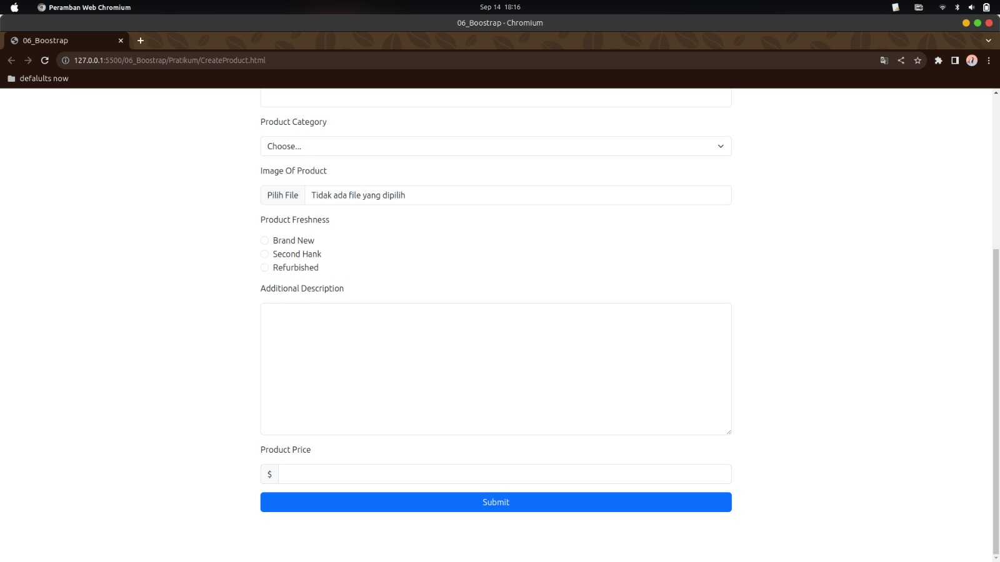

Soal Prioritas 1 (Nilai 80)
Gunakan komponent bootstrap seperti navbar untuk membuat navigation di LandingPage.html
Gunakan komponent bootstrap seperti button dan form di halaman CreateProduct.html
Buatlah halaman CreateProduct.html seperti gambar dibawah. link figma

Soal Prioritas 2 (Nilai 20)
Gunakan grid system dari BS ketika membuat CreateProduct.html.
Buatlah halaman memiliki validasi memanfaatkan BS

