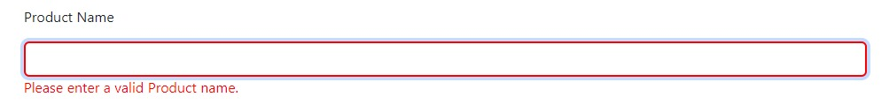
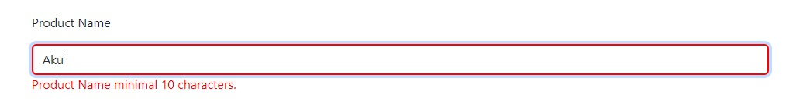
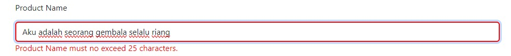
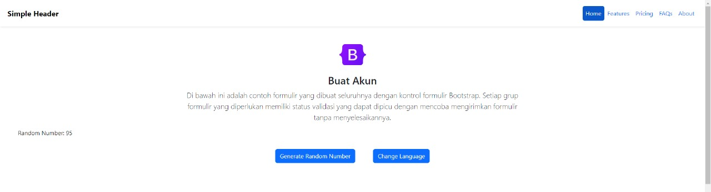

React Event Handling

🎯 Objective
React Event handling adalah cara menangani event yang terjadi di dalam aplikasi ReactJS, seperti menangani klik tombol, mengetik di input field, dan lain-lain.

📝 Task
Soal Prioritas 1 (Nilai 80)
Buatlah sebuah button dan terapkan event handling onClick pada salah satu tombol dihalaman CreateProduct.jsx. Jika tombol tersebut di-klik nantinya akan menampilkan random number di console.
buatlah sebuah file yang berisikan object berikut
const article = {

  title: {

    id: "Buat Akun",

    en: "Create Account"

  },

  description: {

    id: "Di bawah ini adalah contoh formulir yang dibuat seluruhnya dengan kontrol formulir Bootstrap. Setiap grup formulir yang diperlukan memiliki status validasi yang dapat dipicu dengan mencoba mengirimkan formulir tanpa menyelesaikannya.",

    en: "Below is an example form built entirely with Bootstrap’s form controls. Each required form group has a validation state that can be triggered by attempting to submit the form without completing it."

  }

};

gunakan object tersebut sebagai data/text ketika ingin membuat tampilan title dan deskipsi pada tampilan di bawah. gunakan bahasa inggris sebagai bahasa seperti digambar.

Soal Prioritas 2 (Nilai 20)
Gunakan event handling onChange untuk validasi value secara realtime yang dimasukan kedalam form input. Validasi ini meliputi :
Product Name tidak boleh melebihi 10 karakter
Jika Product Name melebihi 25 karakter tambilkan pesan error atau peringatan/alert seperi "Last Name must not exceed 25 characters."
Product Name tidak boleh kosong. Jika field tersebut kosong saat tombol Submit/Create Product di tekan maka tampilkan alert atau error bahwa field tersebut tidak boleh kosong. Misal "Please enter a valid product name."

Soal Eksplorasi (Nilai 20)
Pada halaman CreateProduct.jsx lakukan validasi seperti berikut
Jika salah satu field tidak valid/salah berikan border merah atau tampilkan icon error pada field tersebut dengan React Event Handling. (product freshness tidak harus memiliki validasi)
Buatlah button untuk mengganti text pada halaman.
Buatlah sebuah button yang berfungsi mengganti bahasa yang digunakan pada halaman CreateProduct.jsx . Jika tombol itu di klik maka title dan deskripsi text pada halaman CreateProduct.jsx akan berubah menjadi text indonesia.
ketika kita menggunakan text indonesia dan melakukan klik pada button tersebut akan berganti menjadi text inggris.

📝 Note
penempatan tombol tidak ditentukan, silahkan pilih posisi tombol kalian sesuka hati
untuk product freshness dan image belum harus berfungsi. nantinya kita akan mempelajari penggunaan form tersebut pada materi form.
bentuk alert tidak di tentukan
kalian bisa mengganti style button sesuai keinginan kalian
